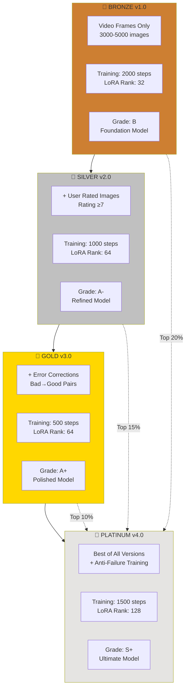
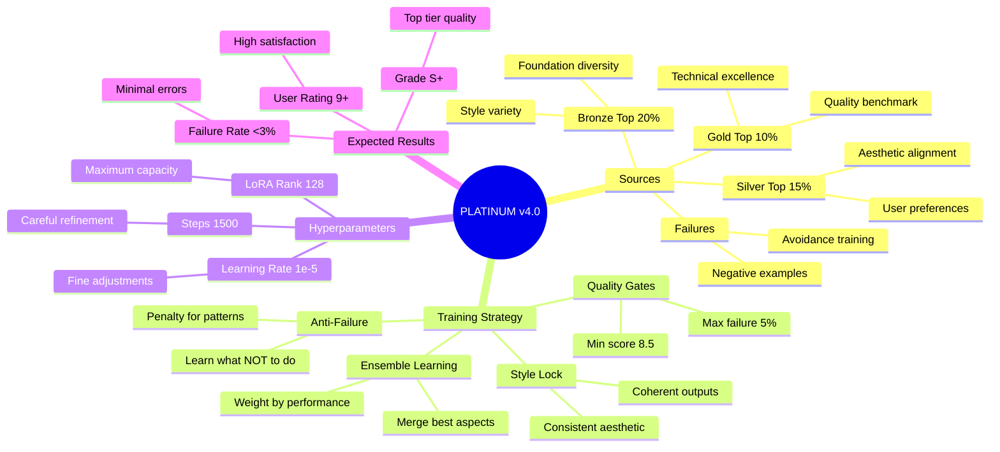

# 📊 SYSTEM DIAGRAMS
## Mermaid Diagrams for AI Image Studio

---

## 1. High-Level System Architecture

```mermaid
flowchart TB
    subgraph INPUT["📥 INPUT LAYER"]
        VS[("Video Source<br/>55GB, 400+ files")]
        UI[("User Images<br/>Rated Collection")]
    end

    subgraph FILTERING["🔍 FILTERING LAYER"]
        VF[Video Filter<br/>LM Studio Vision]
        FF[Frame Filter<br/>Quality Check]
        
        VS --> VF
        VF -->|Approved| FF
        VF -->|Rejected| RJ[(Rejected<br/>Archive)]
    end

    subgraph TRAINING["🎓 TRAINING LAYER"]
        FF --> TD[(Training<br/>Dataset)]
        UI --> TD
        
        TD --> B[BRONZE v1.0<br/>Foundation]
        B --> S[SILVER v2.0<br/>Refined]
        S --> G[GOLD v3.0<br/>Polished]
        G --> P[PLATINUM v4.0<br/>Ultimate]
    end

    subgraph EVALUATION["📊 EVALUATION LAYER"]
        B --> EV[Model Evaluator]
        S --> EV
        G --> EV
        P --> EV
        
        EV --> SC[(Scores &<br/>Metrics)]
    end

    subgraph OUTPUT["📤 OUTPUT LAYER"]
        P --> GEN[Image Generator<br/>ComfyUI]
        GEN --> OUT[(Generated<br/>Images)]
        OUT --> UI
    end

    subgraph DASHBOARD["🖥️ MONITORING"]
        DB[WPF Dashboard<br/>Real-time Stats]
        
        VF -.->|Stats| DB
        EV -.->|Metrics| DB
        GEN -.->|Progress| DB
    end

    style INPUT fill:#1e3a5f
    style FILTERING fill:#2d4a3e
    style TRAINING fill:#4a3d2d
    style EVALUATION fill:#3d2d4a
    style OUTPUT fill:#2d3d4a
    style DASHBOARD fill:#3d4a2d
```



---

## 2. Video Filtering Pipeline

```mermaid
flowchart LR
    subgraph INPUT
        V[("📹 Video<br/>File")]
    end

    subgraph EXTRACT["Frame Extraction"]
        direction TB
        E1[Frame 1<br/>25%]
        E2[Frame 2<br/>50%]
        E3[Frame 3<br/>75%]
    end

    subgraph ANALYZE["LM Studio Analysis"]
        direction TB
        A1["🔍 Gender<br/>Detection"]
        A2["📐 Body Type<br/>Classification"]
        A3["⭐ Quality<br/>Score"]
        A4["💎 Attractiveness<br/>Rating"]
    end

    subgraph FILTER["Filter Logic"]
        F{Decision}
    end

    subgraph OUTPUT
        AP[("✓ Approved")]
        RJ[("✗ Rejected")]
    end

    V --> E1 & E2 & E3
    E1 & E2 & E3 --> A1
    A1 --> A2 --> A3 --> A4
    A4 --> F
    
    F -->|Female + Quality ≥4| AP
    F -->|Male/Heavy/Low Q| RJ

    style INPUT fill:#1a365d
    style EXTRACT fill:#2c5282
    style ANALYZE fill:#2a4365
    style FILTER fill:#1e3a5f
    style OUTPUT fill:#234e52
```



---

## 3. Model Version Evolution



---

## 4. Evaluation Metrics Flow

```mermaid
flowchart LR
    subgraph METRICS["📊 Metrics Collection"]
        AS[Aesthetic Score<br/>LAION Predictor]
        PA[Prompt Adherence<br/>CLIP Score]
        TQ[Technical Quality<br/>Artifact Detection]
        CS[Consistency<br/>Style Analysis]
        UP[User Preference<br/>Ratings 0-15]
        FR[Failure Rate<br/>Error Analysis]
    end

    subgraph WEIGHTS["⚖️ Weights"]
        W1[25%]
        W2[15%]
        W3[20%]
        W4[10%]
        W5[20%]
        W6[10%]
    end

    subgraph COMPOSITE["🎯 Composite Score"]
        CALC[Weighted Average]
        SCORE[Score: 0-10]
    end

    subgraph GRADE["🏆 Grade Assignment"]
        G_S["S+ (9.0+)"]
        G_A["A (7.0-8.9)"]
        G_B["B (5.0-6.9)"]
        G_C["C (<5.0)"]
    end

    AS --> W1 --> CALC
    PA --> W2 --> CALC
    TQ --> W3 --> CALC
    CS --> W4 --> CALC
    UP --> W5 --> CALC
    FR --> W6 --> CALC

    CALC --> SCORE
    SCORE --> G_S & G_A & G_B & G_C

    style METRICS fill:#2d3748
    style WEIGHTS fill:#4a5568
    style COMPOSITE fill:#2c5282
    style GRADE fill:#234e52
```



---

## 5. Dashboard Data Flow

```mermaid
flowchart TB
    subgraph SOURCES["Data Sources"]
        LM[LM Studio<br/>Port 1234]
        OL[Ollama<br/>Port 11434]
        VF[Video Filter<br/>Script]
        TR[Training<br/>Script]
        EV[Model<br/>Evaluator]
    end

    subgraph API["FastAPI Backend<br/>Port 8000"]
        REST[REST Endpoints]
        WS[WebSocket<br/>/ws/live]
        STATE[State Manager]
    end

    subgraph DASHBOARD["WPF Dashboard"]
        SYS[System Status<br/>Cards]
        VID[Video Stats<br/>Progress]
        MOD[Model<br/>Comparison]
        TRN[Training<br/>Monitor]
        PRV[Frame<br/>Preview]
    end

    LM -->|Health| REST
    OL -->|Health| REST
    VF -->|Stats| REST
    TR -->|Progress| REST
    EV -->|Metrics| REST

    REST --> STATE
    STATE --> WS

    WS -->|Real-time| SYS
    WS -->|Real-time| VID
    WS -->|Real-time| MOD
    WS -->|Real-time| TRN
    WS -->|Real-time| PRV

    style SOURCES fill:#2d3748
    style API fill:#4a5568
    style DASHBOARD fill:#2c5282
```



---

## 6. Complete Training Pipeline

```mermaid
sequenceDiagram
    participant V as Video Source
    participant F as Filter Engine
    participant L as LM Studio
    participant D as Dataset
    participant T as Training Engine
    participant E as Evaluator
    participant U as User

    rect rgb(45, 55, 72)
        Note over V,F: Phase 1: Video Filtering
        V->>F: Load Video
        F->>L: Analyze Frames
        L-->>F: JSON Analysis
        F->>D: Save Approved Frames
    end

    rect rgb(44, 82, 130)
        Note over D,T: Phase 2: Bronze Training
        D->>T: Video Frames Dataset
        T->>T: Train 2000 steps
        T->>E: Bronze v1.0 Model
    end

    rect rgb(72, 77, 42)
        Note over U,T: Phase 3: Silver Training
        U->>D: Rate Generated Images
        D->>T: + High-rated Images
        T->>T: Fine-tune 1000 steps
        T->>E: Silver v2.0 Model
    end

    rect rgb(77, 42, 72)
        Note over E,T: Phase 4: Gold Training
        E->>D: Identify Failures
        D->>T: + Error Corrections
        T->>T: Correct 500 steps
        T->>E: Gold v3.0 Model
    end

    rect rgb(42, 72, 77)
        Note over E,T: Phase 5: Platinum Training
        E->>D: Best of All + Anti-patterns
        D->>T: Combined Dataset
        T->>T: Master 1500 steps
        T->>E: Platinum v4.0 Model
    end

    E->>U: Final Production Model
```



---

## 7. Platinum Model Learning Strategy



---

## 8. WPF Dashboard Component Structure

```mermaid
flowchart TB
    subgraph APP["Application"]
        MW[MainWindow]
    end

    subgraph VIEWS["Views"]
        DV[DashboardView]
        VBV[VideoBrowserView]
        MCV[ModelComparisonView]
        TMV[TrainingMonitorView]
        SV[SettingsView]
    end

    subgraph VIEWMODELS["ViewModels"]
        MVM[MainViewModel]
        DVM[DashboardViewModel]
        VBVM[VideoBrowserViewModel]
        MCVM[ModelComparisonViewModel]
        TMVM[TrainingMonitorViewModel]
    end

    subgraph MODELS["Models"]
        VS[VideoStats]
        FA[FrameAnalysis]
        MV[ModelVersion]
        TP[TrainingProgress]
        SH[SystemHealth]
    end

    subgraph SERVICES["Services"]
        API[ApiService]
        WS[WebSocketService]
        SS[SettingsService]
    end

    MW --> DV & VBV & MCV & TMV & SV
    
    DV --> DVM
    VBV --> VBVM
    MCV --> MCVM
    TMV --> TMVM
    
    MVM --> VS & FA & MV & TP & SH
    DVM --> VS & FA & SH
    MCVM --> MV
    TMVM --> TP

    DVM --> API & WS
    VBVM --> API
    MCVM --> API
    TMVM --> API & WS

    style APP fill:#1a365d
    style VIEWS fill:#2c5282
    style VIEWMODELS fill:#2a4365
    style MODELS fill:#285e61
    style SERVICES fill:#234e52
```



---

## Usage Notes

### Rendering Mermaid Diagrams

These diagrams can be rendered in:
- **GitHub/GitLab Markdown viewers** (native support)
- **VS Code** with Mermaid extension
- **Obsidian** (native support)
- **Notion** (native support)
- **Online**: [mermaid.live](https://mermaid.live)

### Exporting to SVG/PNG

Use the Mermaid CLI to export:
```bash
npx @mermaid-js/mermaid-cli mmdc -i SYSTEM-DIAGRAMS.md -o diagram.svg
```

Or use the online editor at mermaid.live for quick exports.
